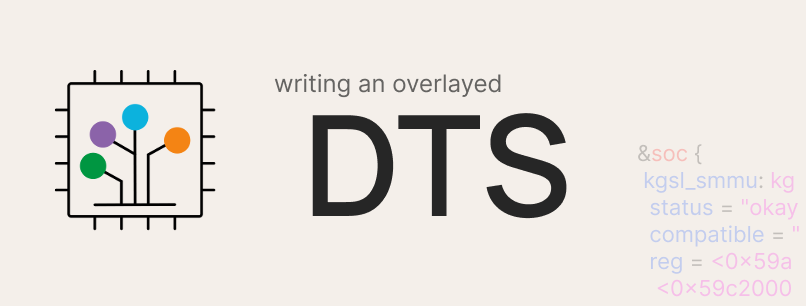

Overlayed device trees are written in order to avoid changing the base device tree structures already present in the kernel source, and just get them overridden during compilation. Learn how to create them!



## Basics
A device tree is a data structure for describing hardware.

Overlayed device trees are written in order to avoid changing the base device tree structures already present in the kernel source, and just get them overridden during compilation.

This will involve modifying OEM device trees from their import commit to a fully overlayed device tree; as an example, from [this][x01ad-stock-dts] to [this][x01ad-overlayed-dts].

## Steps
### 1. Find the initial device tree import for your device
For example, in my case on the device Asus X01AD (sdm632), they were added in [this][x01ad-stock-dts] commit.

As you can see, most changes are additions done by the OEM.

Now, grab a dmesg from the stock kernel, and find the name of the DTB that your stock kernel uses. We will need it to create our initial base device tree.

You will find something like this in your dmesg (*start the dmesg from 0'th second*).

`Machine: Qualcomm Technologies, Inc. SDM632 PMI632 QRD SKU3`

which implies our bootloader loads the dtb which points out to `SDM632 PMI632 QRD SKU3` Board Name.

### 2. Make a clean base of your kernel which just boots
For a clean kernel base, we add only the required changes on top of a base CAF (Code Aurora Forum) or ALS (Android Linux Stable) kernel source, which is enough to boot our device.

This minimal change-set differs from device to device, some devices might just boot on dts (device tree structure) imports but some devices might need additional changes in power or video drivers, and hence we must add all these as per requirement.

Before proceeding to write overlayed dts, I will consider that you have succeeded in booting your devices over a clean CAF or ALS base with minimal changes.

As an example, my `Asus X01AD` took quite a few changes to boot; you can look into it [here][x01ad-stock-changes].

### 3. Get to know the device tree
Now stalk (well, research or learn about) your dtsi imports so that you can know what the OEM changed over the base source – the additions and deletions, addition of new panels and battery data, and so on.

### 4. Create your DTS file
Every device boots only on a single DTSI which points to the correct board name. In my case, it pointed to `SDM632 PMI632 QRD SKU3` as we saw in point 1, and I found `model = "Qualcomm Technologies, Inc. SDM632 + PMI632 SOC";` in `sdm632.dts`.

As per my convenience, I named it `sdm632-X01AD.dts` – you can choose whatever name you want. This will be the DTS which includes other overlayed DTS.

### 5. Make our kernel build our new DTS
You need to include the DTS in the `Makefile` of the `dts` directory – `arch/arm64/boot/dts/qcom/Makefile`, under the correct architecture name, `ARCH_SDM632` in this case.

You can call our DTS by inserting your `dtsname.dtb` under `architecture`, as seen in [this][x01ad-overlayed-ref1] commit. This is a bit different because I added guards in the `Makefile` to make sure only one DTB for my device is built, since it takes up space for no reason if the ones not needed are built too.

### 6. Organising the DTS
You can now create a directory to organise the various DTS files if you want to (I called it `X01AD`). You can also create sub-directories if you want, mainly to divide display panel DTS or the battery data DTS and so on, this is all upto you.

### 7. Identifying the DSI panel and battery data DTSIs
This step is for those who cannot recognise which dtsi are for DSI (Device Serial Interface) panels or battery data.

To find them, you can check names of DTSIs in your OEM import. This works in most cases. Display panel DTSI will look like `dsi-panel-"name-of-driver"-"resolution"-video.dtsi`.

Battery data DTSIs are different as per devices, so we will find them accordingly.

In my case, I found `dsi-panel-ili9881h-720p-video.dtsi` for display and `Huaqin_QL1830scud_4000mAh_averaged_MasterSlave_Sept25th2018_PMI632.dtsi` for battery data.

### 8. Creating the base DTSI
You now need to create a base DTSI in your custom directory and include it at the end of the `.dts` file we created in point 4.

You can include it as `#include "your-custom-directory/base.dtsi"`.

My base dtsi is `X01AD-base.dtsi` and is included in [this][x01ad-overlayed-ref2] commit.

Note that the base dtsi is created to bind up includes in a directory – it's upto you if you want to include other DTSIs from your base DTS or use my way, they're both fine.

### 9. Verifying our DTB builds
You can try to build your kernel and check if it goes fine. You can skip this step if you're confident about your work, it's just to confirm if our includes are correct.

In my case, I found my DTB built in `out/arch/arm64/boot/dts`.

Now – this might be discouraging, but we've just begun; up until now, we haven't finished 10% of the work. Battery data and DSI panel changes are just additions, so that's the easiest part.

### 10. Checking out the changes in DTSI import commit
For example, let's take `msm8953.dtsi` as per [this][x01ad-stock-ref2] commit.

Create a similar DTSI in your desired overlayed directory. This will make it easy for you and others to recall. In my case, it was `X01AD-msm8953.dtsi`.

Now include this in your base overlay DTS or DTSI that you created in your device directory.

### 11. Bringing in changes
Check the syntax in your OEM DTSI.

In my case, the DTSI starts with `/ {`.

DTSIs can start with braces (as you saw above) or nodes – `&node`.

Now, let's have a look at another example.

In this [line][x01ad-stock-ref2], the address of the `other_ext` region has been changed.

In order to write that in our overlayed DTSI, write a new dtsi with `/ {`, and follow up till that address, the `other_ext_region`.

There's no need to include other regions, adresses, or nodes, since our OEM has not modified them, leaving them as-is to be included from the base DTSI.

This is an important step, since if it goes wrong, you will end up with weird cryptic errors from `dtc`. Our purpose can be to add, remove, or overwrite nodes, or to change regions, or add or remove properties.

If you understood the above your dtsi should look as such:

```C
/ {
    reserved-memory {
        other_ext_mem: other_ext_region@0 {
```
It's now time to write our updated property:

`reg = <0x0 0x84a00000 0x0 0x1e00000>;`

And now we just close the curly braces as per the syntax:

```C
/ {
    reserved-memory {
        other_ext_mem: other_ext_region@0 {
            reg = <0x0 0x84a00000 0x0 0x1e00000>;
        };
    };
};
```
There you go – you just made the same OEM changes overlayed in a new DTSI which will now be overridden onto the base DTSI during compilation.

Other changes will also involve the same process, and you might need to delete nodes or properties as such:

`/delete-property/ property-name;`

`/delete-node/ node-name;`

Here's an [example][final-example].

[x01ad-stock-dts]: https://github.com/stormbreaker-project/linux-asus-x01ad/commit/d4fd8d9a664672056e4b68a31da298a4d4bc79ac
[x01ad-overlayed-dts]: https://github.com/stormbreaker-project/linux-asus-x01ad/commit/85b3cb884acf30831a4185327a19a2c4268e457a
[x01ad-stock-changes]: https://github.com/stormbreaker-project/linux-asus-x01ad/tree/423c09527a97e55cca9a9ccfca247b1b179e3ebc
[x01ad-overlayed-ref1]: https://github.com/stormbreaker-project/linux-asus-x01ad/commit/85b3cb884acf30831a4185327a19a2c4268e457a#diff-6ef2edc037b112b898a8ae8cf2e368a6cbc75dda5cc8a5dc9be6b1146ca4569dR10
[x01ad-overlayed-ref2]: https://github.com/stormbreaker-project/linux-asus-x01ad/commit/85b3cb884acf30831a4185327a19a2c4268e457a#diff-abc3be0451bc6bc9e957cd04db3f9bae2b34fbe57cd748e53adb8404d2aa57d2R31
[x01ad-stock-ref1]: https://github.com/stormbreaker-project/linux-asus-x01ad/commit/d4fd8d9a664672056e4b68a31da298a4d4bc79ac#diff-e8966e9b69f2736b98f83b94f0850b361f5c3c01b12d71ec162dbefc02d732bd
[x01ad-stock-ref2]: https://github.com/stormbreaker-project/linux-asus-x01ad/commit/d4fd8d9a664672056e4b68a31da298a4d4bc79ac#diff-e8966e9b69f2736b98f83b94f0850b361f5c3c01b12d71ec162dbefc02d732bdR72
[final-example]: https://github.com/stormbreaker-project/linux-asus-x01ad/commit/85b3cb884acf30831a4185327a19a2c4268e457a#diff-c7c6dacf6c6f713797447bf43699cfa3563f0a325f7261d7b35a64e263537db8R39