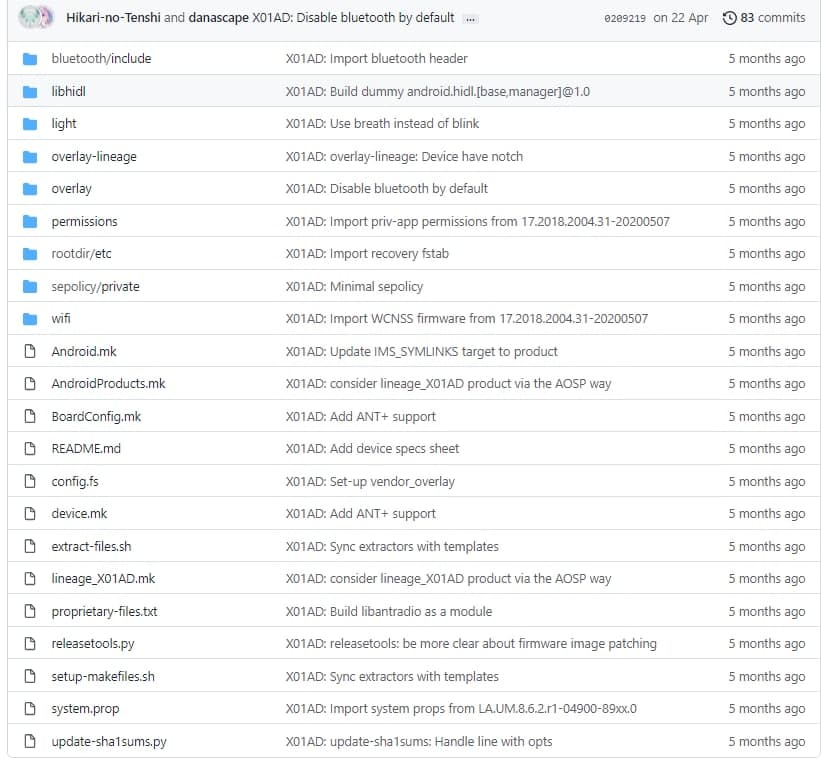

Learn how to bring-up a device tree for your device so you can get started with building your favourite custom ROM!


Some of you guys might be wondering how people create your favorite custom ROMs like LineageOS, PixelExperience, HavocOS, and so on. I'm here to guide you about the basics of a device tree and how to do a scratch bring-up of your own.

This article is a follow-up to my earlier article, [Introduction to AOSP][previous-blog] in which we discussed the fundamentals of and how to join the Android Open Source Project.

### Prerequisites
Certain requirements are to be met before starting the bringup.

1. Ability to understand basic editing/writing of files and text, familiarity with the command line interface and some basic git knowledge.

2. A machine powerful enough to build Android – you can check the basic requirements [here][aosp-requirements].

3. Possess a fundamental understanding of the Android Open Source Project's build system, commands, and other aspects. You can read more about it [here][previous-blog].

### Note:
* This guide only applies to devices launched with Project Treble enabled (Android Oreo 8.0+).
* The device tree I'm using as a reference is a Qualcomm SDM632 (MSM8953) based tree, launched with Android 8.1.
* The guide uses LineageOS as the Android ROM Build System. Each ROM can have their own unique build system which might differ.
* The partition table of devices might differ from the device taken as an example below.

## Understanding Basic Structure
Android device trees are certain bits and bytes of `Makefile` code that allows the Android build system to recognize the specifications of the target device, and what all is to be built along with it.

After reading this guide, you will be able to bringup a prebuilt vendor based device tree (will explain what that means in a while).

To start, let's look at a basic bringup:


These certain files and folders are ones we come across in every other device tree.

Let's break down the important ones:
* **Android.mk**: This is the most basic `Makefile` definition for any path to be included in the Android build system. This `Makefile` calls for all other `Makefiles` present in the all the directories and subdirectories of the device tree. The basic use of this specific `Makefile` is to guard the device tree `Makefiles` when not building for our target device.
* **BoardConfig.mk**: This contains the Board (SoC/Chipset) specific definition, such as the architecture (arm, arm64, x86, so on), the required build flags and the kernel build flags. These flags aid the build process.
* **aosp_<*device-name*>.mk**: This is a common `Makefile` found in most AOSP trees. This specific `Makefile` defines device name, manufacturer and build product details and is also used to call **device.mk** described below.
* **AndroidProducts.mk**: This `Makefile` includes the device product `Makefiles`, i.e. the aforementioned **aosp_<*device-name*>.mk** on `lunch` (term used to initialise device trees for build). This `Makefile` also defines the lunch target (Android 10+).
* **device.mk**: This `Makefile` contains all the build targets and copy specifications such as audio configs, feature configs, and so on. If you want a certain package to be built inline with Android ROM builds, this where you'd want to define it. The vendor tree `Makefiles` are also called from here.
* **vendorsetup.sh**: This shell script was superceded by `AndroidProducts.mk` after Android 10.

### Note:
* Not all the contents of a device tree are needed to be brought up from scratch since only certain files differ as per device and chipset, so I mentioned only the required ones.

## Starting the Bringup
Now that we know the basic structure of an android device tree, let's start our bringup.
* A prebuilt vendor based device tree is the one which uses device OEM vendor to run ROM. Basically while flashing ROMs based on this device tree you do not need to wipe vendor.
* You'll need to figure out the codename of the device by looking at the **build number** or **reading the build.prop** or **checking the stock rom dump**. This is not important and you can use any codename for your device.

P/S : My friend chose amogus as his device's codename.

* You'll also need to create a directory where your device tree will be placed and called by Android Build System.

According to Google devices, you can create this directory in `device/device-implementer/device-name/`, where the device implementer is the device manufacturer, such as `asus`, `google`, `oneplus`, `oppo`, `realme`, `xiaomi`, and so on.

## Starting with Android.mk
* It must begin by defining the `LOCAL_PATH` variable such that android build system can call the makefile:
```Makefile
LOCAL_PATH := $(call my-dir)
```
* Now we would need to guard our device `Makefiles` to only be called when it's mentioned in `lunch`:
```Makefile
ifeq ($(TARGET_DEVICE),<device-codename>)
endif
```
This means that it will start including the device tree **only** if the `TARGET_DEVICE` variable is set to your device.

In order for our Android `Makefile` to include all other makefiles in the directory or sub directories, you can do it as:
```Makefile
ifeq ($(TARGET_DEVICE),<device-codename>)

include $(call all-makefiles-under,$(LOCAL_PATH))

endif
```
In my case, the device's codename is X01AD, so in the end it should look like this:
```Makefile
LOCAL_PATH := $(call my-dir)

ifeq ($(TARGET_DEVICE),X01AD)

include $(call all-makefiles-under,$(LOCAL_PATH))

endif
```
This concludes the basic `Android.mk` structure.

## Moving on to BoardConfig.mk
* As the name suggests, it includes board specific variables, such as chipset or device specific feature flags.
* There's a certain set of flags that are important for all devices, such as the architecture, command line and partition information.

Since I have an `arm64` based Qualcomm device, I can start with setting up base architecture as such:
```Makefile
TARGET_ARCH := arm64
TARGET_ARCH_VARIANT := armv8-a
TARGET_CPU_ABI := arm64-v8a
TARGET_CPU_ABI2 :=
TARGET_CPU_VARIANT := generic
```
and a fallback secondary architecture as:
```Makefile
TARGET_2ND_ARCH := arm
TARGET_2ND_ARCH_VARIANT := armv8-a
TARGET_2ND_CPU_ABI := armeabi-v7a
TARGET_2ND_CPU_ABI2 := armeabi
TARGET_2ND_CPU_VARIANT := generic
```
The Android build server generates build artifacts and VNDK snapshot files using the following build parameters. You can read more about them [here][bcmk-abis-cmake] and [here][bcmk-vndk-snap].

For those who have an `arm` based device, you can just set:
```Makefile
TARGET_ARCH := arm
TARGET_ARCH_VARIANT := armv8-a
TARGET_CPU_ABI := armeabi-v7a
TARGET_CPU_ABI2 := armeabi
TARGET_CPU_VARIANT := generic
```
These are global variables and can be used for all devices. Developers might change CPU variants according to chipsets but that's not necessary.

* Now, you need to define your device bootloader variables as such:
```Makefile
TARGET_BOOTLOADER_BOARD_NAME := #(Based on your device)
TARGET_NO_BOOTLOADER := true #(For source to not build bootloader)
```
For my device it looks like this:

## Moving on to the kernel build system
We will set up the required flags as per the LineageOS build system.

In Android, Qualcomm (QCOM) and Mediatek (MTK) chipsets set some kernel parameters which are picked up by their Operating System (the preloaded stock ROM). They are set in device tree source as a kernel cmdline parameter this way:
```Makefile
# You can have additional values to the same flag by using the append symbol ("+=") instead of initialise symbol (":=")

BOARD_KERNEL_CMDLINE := #(This is initialised)
BOARD_KERNEL_CMDLINE +=
```
You can obtain your device cmdline by unpacking your stock firmware bootimage using mkbootimg tools from [here][bcmk-mkbootimg]. During unpack you will obtain an output with kernel cmdline which looks like:

`
cmd_line='console=ttyMSM0,115200n8 androidboot.hardware=qcom androidboot.console=ttyMSM0 androidboot.memcg=1 lpm_levels.sleep_disabled=1 video=vfb:640x400,bpp=32,memsize=3072000 msm_rtb.filter=0x237 service_locator.enable=1 swiotlb=1 androidboot.usbcontroller=a600000.dwc3 earlycon=msm_geni_serial,0x880000 loop.max_part=7'
`

So after setting up your kernel cmdline you need to set some base kernel flags which matches your stock bootimage in order for it to boot up your device:
```Makefile
BOARD_KERNEL_BASE :=
BOARD_KERNEL_PAGESIZE :=
BOARD_KERNEL_TAGS_OFFSET :=
BOARD_RAMDISK_OFFSET :=
```
They can be obtained from mkbootimg tools during unpack of your stock firmware bootimage. Read more about them [here][bcmk-boot-header].

After setting the flags, we want our kernel source to get built; as per the LineageOS build system we can either build our kernel from source or use prebuilt binaries as per our convenience. Usage of a source built kernel looks like this:
```Makefile
TARGET_KERNEL_CONFIG := #(Kernel Config name to be picked up as per architecture from kernel-source-path/arch/<device-architecture>/configs/)

TARGET_KERNEL_SOURCE := #(Your kernel source path from root of Android source)
```
After setting up your flags it should look like this:
```Makefile
BOARD_KERNEL_CMDLINE := console=ttyMSM0,115200,n8 androidboot.hardware=qcom
BOARD_KERNEL_CMDLINE += androidboot.console=ttyMSM0
BOARD_KERNEL_CMDLINE += msm_rtb.filter=0x237 ehci-hcd.park=3
BOARD_KERNEL_CMDLINE += lpm_levels.sleep_disabled=1
BOARD_KERNEL_CMDLINE += androidboot.bootdevice=7824900.sdhci
BOARD_KERNEL_CMDLINE += earlycon=msm_serial_dm,0x78af000
BOARD_KERNEL_CMDLINE += firmware_class.path=/vendor/firmware_mnt/image
BOARD_KERNEL_CMDLINE += androidboot.usbconfigfs=true
BOARD_KERNEL_CMDLINE += loop.max_part=7
BOARD_KERNEL_CMDLINE += androidboot.selinux=permissive

BOARD_KERNEL_BASE := 0x80000000
BOARD_KERNEL_PAGESIZE :=  2048
BOARD_KERNEL_IMAGE_NAME := Image.gz-dtb
BOARD_KERNEL_TAGS_OFFSET := 0x00000100

BOARD_RAMDISK_OFFSET := 0x01000000

TARGET_KERNEL_CONFIG := X01AD_defconfig
TARGET_KERNEL_SOURCE := kernel/asus/X01AD
```
A configuration with prebuilt kernel should look like this:
```Makefile
BOARD_KERNEL_CMDLINE := console=ttyMSM0,115200,n8 androidboot.hardware=qcom
BOARD_KERNEL_CMDLINE += androidboot.console=ttyMSM0
BOARD_KERNEL_CMDLINE += msm_rtb.filter=0x237 ehci-hcd.park=3
BOARD_KERNEL_CMDLINE += lpm_levels.sleep_disabled=1
BOARD_KERNEL_CMDLINE += androidboot.bootdevice=7824900.sdhci
BOARD_KERNEL_CMDLINE += earlycon=msm_serial_dm,0x78af000
BOARD_KERNEL_CMDLINE += firmware_class.path=/vendor/firmware_mnt/image
BOARD_KERNEL_CMDLINE += androidboot.usbconfigfs=true
BOARD_KERNEL_CMDLINE += loop.max_part=7
BOARD_KERNEL_CMDLINE += androidboot.selinux=permissive

BOARD_KERNEL_BASE := 0x80000000
BOARD_KERNEL_PAGESIZE :=  2048
BOARD_KERNEL_IMAGE_NAME := Image.gz-dtb
BOARD_KERNEL_TAGS_OFFSET := 0x00000100

BOARD_RAMDISK_OFFSET := 0x01000000

TARGET_PREBUILT_KERNEL := device/asus/X01AD-kernel/Image.gz-dtb
```
Source will pick up these offset flags for use in `mkboot` arguments, so there's no need to set them again in the `BoardConfig`.

## Moving on to partition flags
Different devices have different partition sizes and names. I will using my QCOM device as a reference, but it might be different for your device.

Basically, a built Android OS flashable ZIP flashes over the boot, cache, recovery and system partitions.

After Android 8.0, a new partition named vendor was introduced (Project Treble).

#(Comment need to do something here and redirect over project treble)

After more Android releases more partitions were introduced, so as per Android 11 convention, the partition used by Android are `boot`, `cache`, `odm`, `product`, `recovery`, `system`, `system_ext`, `vendor`. These are basic names and may change (like `system_a`, `system_b` for A/B devices).

You can check path of your partitions using:
```shell
ls -l /dev/block/bootdevice/by-name
```
This path works for most of generic devices and may change.

Now in order to obtain partition sizes
```shell
blockdev --getsize64 <partition-path>
```
Example:
```shell
blockdev --getsize64 /dev/block/bootdevice/by-name/system
```
This will give output of your partition sizes in bytes, you can directly set it as a flag variable so no need to convert the values.

For prebuilt vendor based device trees, you can just fetch partition sizes for `boot`, `cache`, `odm`, `product`, `recovery`, `system`, `system_ext`, and `userdata` (`/data`).

No need to worry if you do not have a certain partition – this list is tentative.

After obtaining the partition sizes to set them as flags you can do this:
```Makefile
BOARD_<partition-name-in-capital>IMAGE_PARTITION_SIZE :=
```
Example:
```Makefile
BOARD_SYSTEMIMAGE_PARTITION_SIZE := 4294967296
```

After that you need to set partition filesystem type, this can be `f2fs`, `ext2`, `ext3`, `ext4`, and so on. You can find your partition filesystem type in your device `fstab` located in `/vendor/etc/fstab.qcom`

To set partition file system type you can do this:
```Makefile
BOARD_<partition-name-in-caps>IMAGE_FILE_SYSTEM_TYPE :=
```
Setting file system time for partitions is not important as the Android build system will pick default types if you do not set them, but the partition `userdata` is an exception where it is absolutely necessary to defined the filesystem type and the flags for doing so are different, namely:

```Makefile
TARGET_USERIMAGES_USE_EXT4 := true
# or
TARGET_USERIMAGES_USE_F2FS:= true
```
After setting up your partition flags and file system types, it should look like this:
```Makefile
# Partitions - Boot
BOARD_BOOTIMAGE_PARTITION_SIZE := 67108864
BOARD_FLASH_BLOCK_SIZE := 131072 # (BOARD_KERNEL_PAGESIZE * 64)

# Partitions - Cache
BOARD_CACHEIMAGE_PARTITION_SIZE := 367001600
BOARD_CACHEIMAGE_FILE_SYSTEM_TYPE := ext4

# Partitions - Recovery
BOARD_RECOVERYIMAGE_PARTITION_SIZE := 67108864

# Partitions - System
BOARD_SYSTEMIMAGE_PARTITION_SIZE := 4294967296

# Partitions - Userdata
BOARD_USERDATAIMAGE_PARTITION_SIZE := 55423516160
```
**Note: keep in mind that these are different as per devices.**

## Moving on to Device Platform
It can be set this way:
```Makefile
TARGET_BOARD_PLATFORM := 
```
it can be `msm8937`, `msm8953`, `sdm660`, and so on. It is to be set according to your device. It is a CAF variable which is picked up by the LineageOS build system in order to build chipset specific HALs (We will learn about this later).

## Moving on to Recovery fstab
Won't explain much about it since you can read it [here][bcmk-partition-map].

So after reading the above thread, you can take your device `fstab` which can be found in `/vendor/etc/fstab.qcom` (`fstab.qcom` in my case, it can be anything else for other chipset devices, `fstab.qcom` is picked up by our bootloader) and set the flag pointing out it in device tree.
```Makefile
TARGET_RECOVERY_FSTAB := fstab-path-in-device-source/fstab.qcom
```
Example:
```Makefile
TARGET_RECOVERY_FSTAB := $(DEVICE_PATH)/rootdir/etc/fstab.qcom
```

## Generating VNDK Snapshots
Vendor Native Development Kit, check it out in brief [here][bcmk-vndk-snap].

You can set `BoardConfig` flags as read above and set the VNDK version as per your desired vendor.

As a default behaviour, source sets `BOARD_VNDK_VERSION := current`, here current implies vndk version of current android source (like `29` for Q, `30` for R).

Suppose you are trying to build Android Q for a vendor based on Android 9 – you can then set `PRODUCT_TARGET_VNDK_VERSION :=` value as per your vendor (28 for Pie).

You can also include additional VNDK snapshots for your vendor, like if you want Oreo vndk snapshots as well as Pie, you can set `PRODUCT_EXTRA_VNDK_VERSIONS :=` value as you desire.

## SEPolicy / SELinux
Setting SEPolicy is not very important for prebuilt vendor based device trees as most of selinux rules are defined in vendor sepolicy.

You can read about SEPolicy [here][bcmk-selinux].

Your device will proceed onto boot animation on SELinux due to the same reason as listed above, so you can just fixup the remaining denials by setting up SELinux on the system side.

This can be done by including QCOM sepolicy (Board specific since this guide is for QCOM boards).
```Makefile
BOARD_PLAT_PRIVATE_SEPOLICY_DIR += device/qcom/sepolicy/private
BOARD_PLAT_PUBLIC_SEPOLICY_DIR += device/qcom/sepolicy/public
```
This is global and can be used by any device, `BOARD_PLAT` implies SEPolicy will be updated in system side.

Similarly `BOARD_PRODUCT` for product side.

* Calling out vendor `BoardConfig` `Makefile`
Include your vendor device makefile as:
```Makefile
# Inherit from the proprietary version
include vendor/device-implementer/device-name/BoardConfigVendor.mk
```
Example:-
```Makefile
# Inherit from the proprietary version
include vendor/asus/X01AD/BoardConfigVendor.mk
```
We will learn more about vendor a bit later.

## Starting out with device product
* Source calls device product which relatively calls other `Makefiles` present in the device tree.
* By default when a product `Makefile` is called, it also includes the `BoardConfig` `Makefile`, so we don't need to include it.
* A device product `Makefile` looks like `ROM-name_device-name.mk`, for example `lineage_X01AD.mk`. This can change accordingly for other ROMs.
* In the device product `Makefile` you can configure if you want 64/32-bit apps to run on your system, whether your device will have telephony (radio in basic words) or if it is wifi-only, and so on. These `Makefiles` are found in `build/target/product` in the source directory.

According to basic `Makefile` syntax rules we can call another `Makefile` by using `$(call inherit-product, <makefile-path>)`.

In Android source, there is a variable which sets path for `build/target`, i.e `$(SRC_TARGET_DIR)`, So in order to call a `Makefile` from target product we can just use `$(SRC_TARGET_DIR)/product/<makefile-name>`.

You can read these `Makefiles` for more information.
* Device product `Makefile` is also used to call the ROM specific common `Makefile` (mainly ROM specific features). You can find these `Makefiles` in `vendor/ROM-name/config/` which will be `vendor/lineage/config` in our case.

We can call it this way:
```Makefile
$(call inherit-product, vendor/lineage/config/common_full_phone.mk)
```
* In the end, we need to set device name and product name which should match our ROM-name.

Example:
```Makefile
# Device identifiers.
PRODUCT_NAME := lineage_X01AD
PRODUCT_DEVICE := X01AD
PRODUCT_MANUFACTURER := asus
PRODUCT_BRAND := asus
PRODUCT_MODEL := ASUS_X01AD
```
These are basic device identifiers and I don't think further explanation is required since they're fairly self-explanatory.

## Calling our device product
* Since Android Q, we need to create `AndroidProducts.mk` in order to call our device product makefile.

This can be done this way:
```Makefile
PRODUCT_MAKEFILES := \
    $(LOCAL_DIR)/ROM-name_device-name.mk
```
Example:
```Makefile
PRODUCT_MAKEFILES := \
    $(LOCAL_DIR)/lineage_X01AD.mk
```
You can find a reference commit to set device product [here][AP-product].

## Last but not the least
* You need to call this `Makefile` from device product `Makefile`:
```Makefile
$(call inherit-product, device/device-implementer/device-name/device.mk)
```
Example:
```Makefile
# Inherit from X01AD device
$(call inherit-product, device/asus/X01AD/device.mk)
```
* We create a device makefile in our device tree which defines package names or device dimensions or screen density.

Some basic flags are lister here:
```Makefile
# Boot animation
TARGET_SCREEN_HEIGHT :=
TARGET_SCREEN_WIDTH :=

# Device uses high-density artwork where available
PRODUCT_AAPT_CONFIG :=
PRODUCT_AAPT_PREF_CONFIG :=
```
* You can also inherit your device proprietary system files (will explain a bit later) as follows:
```Makefile
$(call inherit-product-if-exists, vendor/device-implementer/device-name/device-name-vendor.mk)
```

## Customizing the build with overlays
* Android build system uses overlays to customize or override resource values specifically for a product.
* To use overlays, modify the project device `Makefile` to set `PRODUCT_PACKAGE_OVERLAYS` to a path relative to your top-level directory.

You can do it as follows:
```Makefile
PRODUCT_PACKAGE_OVERLAYS := device/device-implementer/device-name/overlay
```
* Default overlays can be found by extracting frameworks-res from your stock device dump using `apktool` (not in scope of this guide).
* Note that overlays are not important to boot the ROM on your device. They are used to overwrite certain properties or values over source to fixup certain bugs related to dimensions or similar.
* Read more about overlays and how they work [here][devicemk-rros].

## Setting up device vendor
* There are certain libraries and APKs which are not source buildable (or proprietary) but are important for devices to have in order to gain some features or functionalities. These libraries or apps are listed in separate repo with proprietary files.
* In order to generate this repository, we extract the required proprietary libraries or apps from stock OEM firmware using *proprietary extract scripts*. These scripts are present in ROM side in certain ROMs which can be picked up from basic scripts which we set in our device trees, and which define certain variables and helps in generating a `Makefile` to ease our work and just call the repo in order to get started.
* At first you can pick these device-side shell scripts from [here][dt-extutils] and modify them based on your device product name and manufacturer.
* Before running your shell scripts create a proprietary files list as per your device called `proprietary-files.txt` this way:
```txt
# ANT
-lib/libantradio.so
-lib64/libantradio.so
product/lib/com.qualcomm.qti.ant@1.0.so
product/lib64/com.qualcomm.qti.ant@1.0.so

# Alarm
product/framework/vendor.qti.hardware.alarm-V1.0-java.jar

# Audio
etc/permissions/audiosphere.xml
framework/audiosphere.jar
```
This is a section of my current proprietary list and it can be different for other devices. You can find my full system-side listing [here][dt-proprfiles].

* Now, hoping that your list is created and all went well, in order to run `extract-files.sh`, you need `adb` support on your system or device dump where you can point out script to extract. You can read these scripts in order to check how they work and extract.
* After you run these scripts, it will extract the apps and libs listed in your proprietary files and will setup makefiles in a separate directory which can be called as listed above in BoardConfig and device makefile section.

## Getting things running
* If all above goes well, you can go to your ROM source directory and `lunch` the device product (I will not explain how to start build as its a basic requirement to know how to build a ROM before you do a bringup).
* Start your build and let it complete. These are only basic requirements for a device to get built and booting it is a different thing. Sometimes your ROM might get stuck on logo or stuck on endless boot animation, you will need to debug these issues in order to get things running.
* I will list up some reference system-only device trees that you can learn from.

[danascape/device_asus_X01AD][ref-x01ad]

[danascape/device_oneplus_billie][ref-billie]

[danascape/device_xiaomi_olive][ref-olive]

[danascape/device_xiaomi_violet][ref-violet]

* Certain device might need more things in order to get booting. These things might include AB or dynamic partition based BoardConfig flags, boot control HAL or gpt-utils or some extra libs. You can check more about how I did these things in above references.

Let me know your new experiences at my [email][email].

[previous-blog]: https://blog.realogs.in/getting-started-with-aosp/
[aosp-requirements]: https://source.android.com/setup/build/requirements
[bcmk-abis-cmake]: https://developer.android.com/ndk/guides/abis#cmake
[bcmk-vndk-snap]: https://source.android.com/docs/core/architecture/vndk/snapshot-generate
[bcmk-mkbootimg]: https://github.com/LineageOS/android_system_core/tree/lineage-17.1/mkbootimg
[bcmk-boot-header]: https://source.android.com/docs/core/architecture/bootloader/boot-image-header#implementing-versioning
[bcmk-partition-map]: https://source.android.com/docs/core/ota/nonab/device_code#partition-map
[bcmk-selinux]: https://source.android.com/security/selinux
[AP-product]: https://github.com/danascape/android_device_asus_X01AD/commit/666612c5b81e514925ebed4b63954313e373804a
[devicemk-rros]: https://source.android.com/devices/architecture/rros
[dt-extutils]: https://github.com/danascape/device_asus_X01AD/commit/08b2897c33ed5cf7fd18198b30752f6
[dt-proprfiles]: https://github.com/danascape/device_asus_X01AD/blob/lineage-17.1-preb/proprietary-files.txt
[ref-x01ad]: https://github.com/danascape/device_asus_X01AD/tree/lineage-17.1-preb
[ref-billie]: https://github.com/danascape/device_oneplus_billie/tree/lineage-17.1-prebuilt
[ref-olive]: https://github.com/danascape/device_xiaomi_olive/tree/lineage-17.1-preb
[ref-violet]: https://github.com/danascape/device_xiaomi_violet/tree/lineage-17.1-prebuilt
[email]: mail:danascape@gmail.com